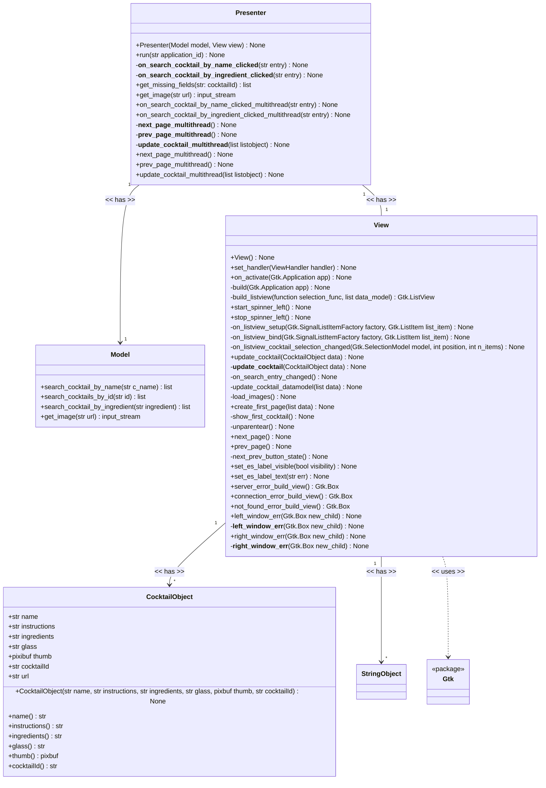
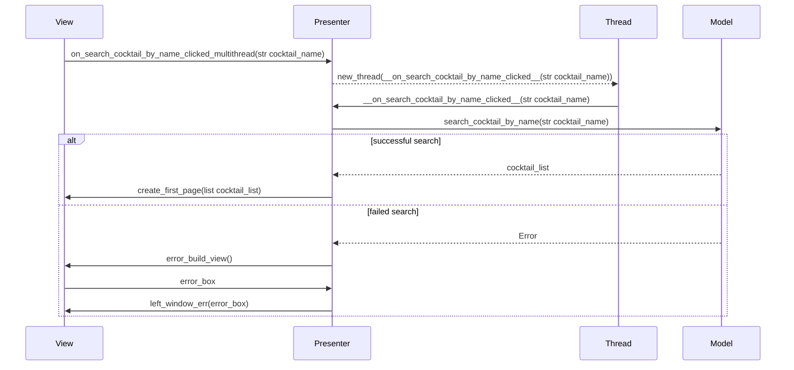
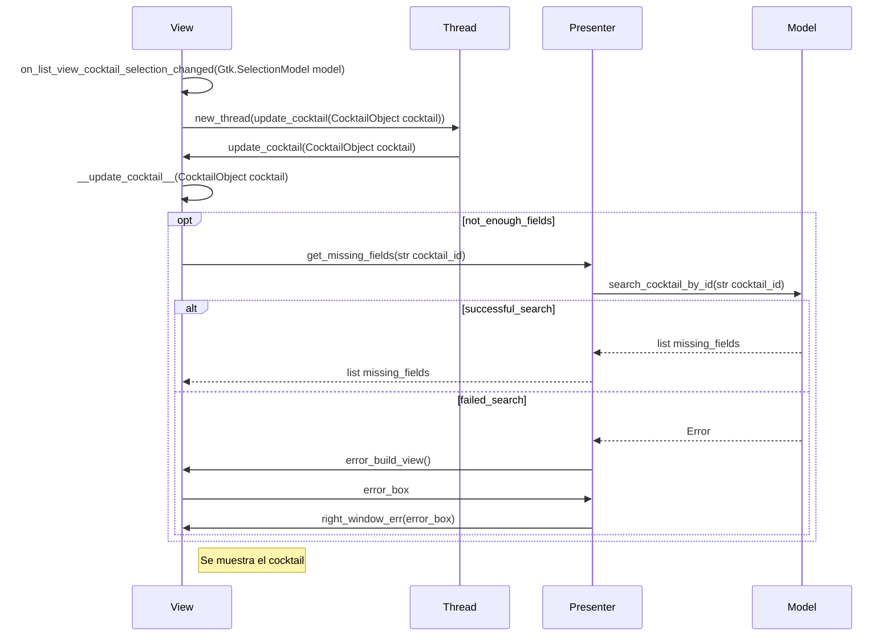

# Diseño software

```mermaid
classDiagram

    class Model{
        +search_cocktail_by_name(str c_name) list
        +search_cocktails_by_id(str id) list
        +search_cocktail_by_ingredient(str ingredient) list
        +get_image(str url) input_stream
    }    
	class View {
        %%No consideramos importantes los atributos de la interfaz como labels, boxes, etc.
        +View() None
        +set_handler(ViewHandler handler) None
        +on_activate(Gtk.Application app)  None
        -build(Gtk.Application app) None
        -build_listview(function selection_func, list data_model) Gtk.ListView
        +start_spinner_left() None
        +stop_spinner_left() None
        -on_listview_setup(Gtk.SignalListItemFactory  factory, Gtk.ListItem list_item) None
        -on_listview_bind(Gtk.SignalListItemFactory factory, Gtk.ListItem list_item) None
        -on_listview_cocktail_selection_changed(Gtk.SelectionModel model,  int position,  int n_items) None
        +update_cocktail(CocktailObject data) None
        -__update_cocktail__(CocktailObject data) None
        -on_search_entry_changed() None
        -update_cocktail_datamodel(list data) None
        -load_images() None
        +create_first_page(list data) None
        -show_first_cocktail() None
        -unparentear() None
        +next_page() None
        +prev_page() None
        -next_prev_button_state() None
        %%Errores
        +set_es_label_visible(bool visibility) None
        +set_es_label_text(str err) None
        +server_error_build_view() Gtk.Box
        +connection_error_build_view() Gtk.Box
        +not_found_error_build_view() Gtk.Box
        +left_window_err(Gtk.Box new_child) None
        -__left_window_err__(Gtk.Box new_child) None
        +right_window_err(Gtk.Box new_child) None
        -__right_window_err__(Gtk.Box new_child) None
	    }

        View "1" --> "*" CocktailObject : << has >>
        View "1" --> "*" StringObject : << has >>
	    View ..> Gtk : << uses >>
	    class Gtk
	    <<package>> Gtk

    class Presenter{
        +Presenter(Model model, View view) None
        +run( str application_id) None
        -__on_search_cocktail_by_name_clicked__(str entry) None
        -__on_search_cocktail_by_ingredient_clicked__(str entry) None
        +get_missing_fields(str: cocktailId) list
        +get_image(str url) input_stream
        +on_search_cocktail_by_name_clicked_multithread(str entry) None
        +on_search_cocktail_by_ingredient_clicked_multithread(str entry) None
        -__next_page_multithread__() None
        -__prev_page_multithread__() None
        -__update_cocktail_multithread__(list listobject) None
        +next_page_multithread() None
        +prev_page_multithread() None
        +update_cocktail_multithread(list listobject) None
        }
        Presenter "1" --> "1" Model  : << has >>
        %%View tiene un presenter y presenter tiene un view (ViewHandler es un protocol)
        Presenter "1" -- "1" View : << has >>

    class CocktailObject{
        +str name
        +str instructions
        +str ingredients
        +str glass
        +pixibuf thumb
        +str cocktailId
        +str url
        +CocktailObject(str name, str instructions, str ingredients, str glass, pixbuf thumb, str cocktailId) None
        +name() str
        +instructions() str
        +ingredients() str
        +glass() str
        +thumb() pixbuf
        +cocktailId() str
    }
```
# DIAGRAMA DE SECUENCIA PARA BUSCAR COCKTAIL POR NOMBRE O POR INGREDIENTE
(Cambiamos "name" por "ingredient" en las funciones)

```mermaid
sequenceDiagram
    View ->> Presenter: on_search_cocktail_by_name_clicked_multithread(str cocktail_name)
    Presenter -->> Thread: new_thread(__on_search_cocktail_by_name_clicked__(str cocktail_name))
    Thread ->> Presenter: __on_search_cocktail_by_name_clicked__(str cocktail_name)
    Presenter ->> Model: search_cocktail_by_name(str cocktail_name)
    alt successful search
        Model -->> Presenter: cocktail_list
        Presenter ->> View: create_first_page(list cocktail_list)
    else failed search
        Model -->> Presenter: Error
        Presenter ->> View: error_build_view()
        View ->> Presenter: error_box
        Presenter ->> View: left_window_err(error_box)
    end
```
# DIAGRAMA DE SECUENCIA CLICK COCKTAIL

```mermaid
sequenceDiagram
    View ->> View: on_list_view_cocktail_selection_changed(Gtk.SelectionModel model)
    View ->> Thread: new_thread(update_cocktail(CocktailObject cocktail))
    Thread ->> View: update_cocktail(CocktailObject cocktail)
    View ->> View: __update_cocktail__(CocktailObject cocktail)
    opt not_enough_fields
        View ->> Presenter: get_missing_fields(str cocktail_id)
        Presenter ->> Model: search_cocktail_by_id(str cocktail_id)
        alt successful_search
            Model -->> Presenter: list missing_fields
            Presenter -->> View: list missing_fields
        else failed_search
            Model -->> Presenter: Error
            Presenter ->> View: error_build_view()
            View ->> Presenter: error_box
            Presenter ->> View: right_window_err(error_box)
        end 
    end
    Note right of View: Se muestra el cocktail
```
