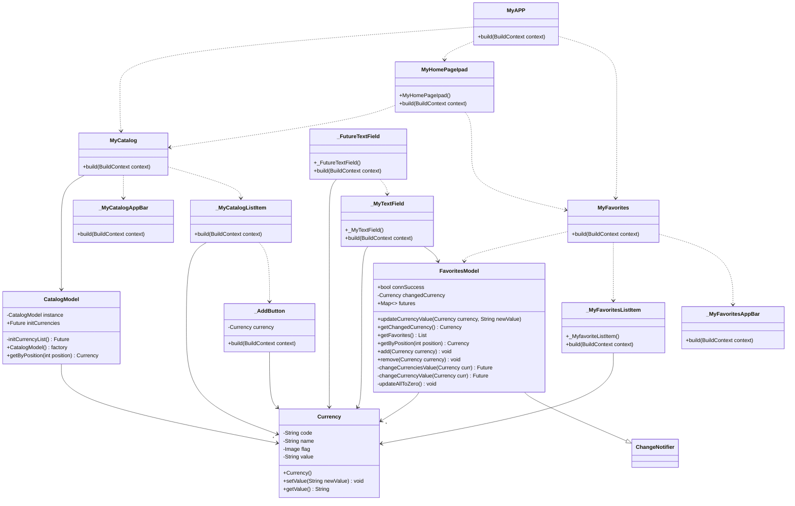
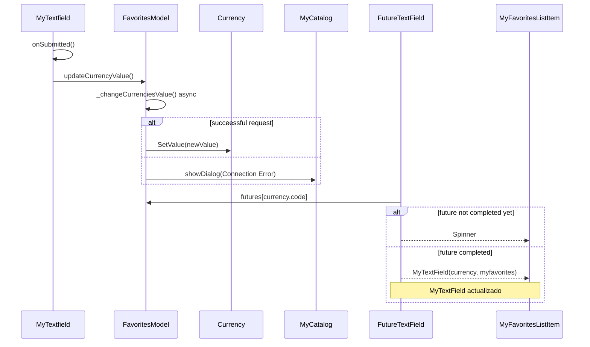
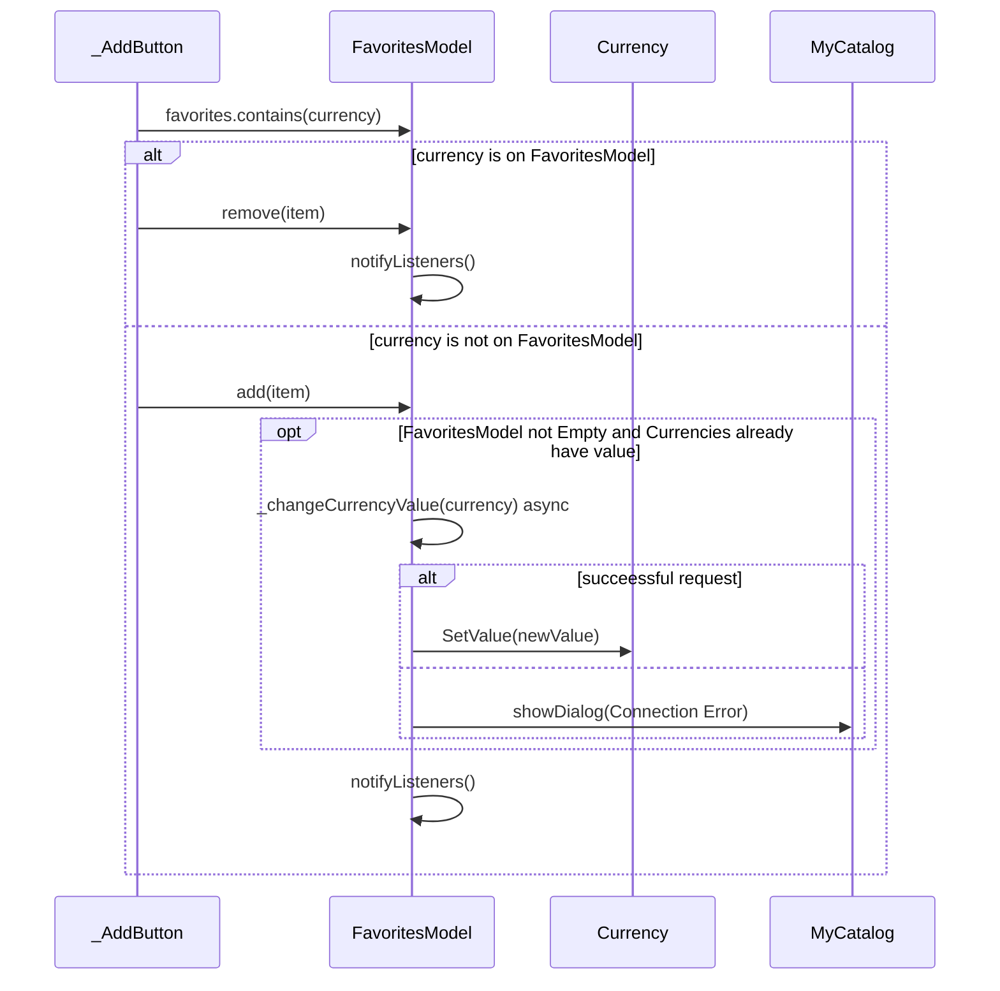

# Diseño software

```mermaid
classDiagram
    
    MyAPP ..> MyCatalog
    MyAPP..> MyHomePageIpad
    CatalogModel --> "*"Currency
    FavoritesModel --> "*"Currency
    FavoritesModel --|> ChangeNotifier
    MyCatalog --> CatalogModel
    _AddButton --> Currency
    _MyCatalogListItem --> Currency
    _MyCatalogListItem..> _AddButton
    MyCatalog ..> _MyCatalogAppBar
    MyCatalog ..> _MyCatalogListItem
    MyFavorites ..> FavoritesModel
    _MyTextField --> Currency
    _MyTextField --> FavoritesModel
    _FutureTextField --> Currency
    _MyFavoritesListItem --> Currency
    MyHomePageIpad ..> MyCatalog
    MyHomePageIpad ..> MyFavorites
    _FutureTextField ..> _MyTextField
    MyFavorites ..> _MyFavoritesListItem
    MyAPP ..> MyFavorites
    MyFavorites ..> _MyFavoritesAppBar
    

    class MyAPP{
        +build(BuildContext context)}
    class Currency{
        -String code
        -String name
        -Image flag
        -String value
        +Currency()
        +setValue(String newValue) void
        +getValue() String}
    class CatalogModel{
        -CatalogModel instance
        +Future<void> initCurrencies
        -initCurrencyList() Future<void>
        +CatalogModel() factory 
        +getByPosition(int position) Currency
        }
    class FavoritesModel{
        +bool connSuccess
        -Currency changedCurrency
        +Map<> futures 
        +updateCurrencyValue(Currency currency, String newValue)
        +getChangedCurrency() Currency
        +getFavorites() List
        +getByPosition(int position) Currency
        +add(Currency currency) void
        +remove(Currency currency) void
        -changeCurrenciesValue(Currency curr) Future
        -changeCurrencyValue(Currency curr) Future
        -updateAllToZero() void
        }
    class MyCatalog{
        +build(BuildContext context)
    }
    class _AddButton{
        -Currency currency
        +build(BuildContext context)
    }
    class _MyCatalogAppBar{
        +build(BuildContext context)
    }
    class _MyCatalogListItem{
        +build(BuildContext context)
    }

    class MyFavorites{
        +build(BuildContext context)
    }
    class _MyFavoritesAppBar{
        +build(BuildContext context)
    }
    class _MyTextField{
        +_MyTextField()
        +build(BuildContext context)
    }
    class _FutureTextField{
        +_FutureTextField()
        +build(BuildContext context)
    }
    class _MyFavoritesListItem{
        +_MyfavoriteListItem()
        +build(BuildContext context)
    }
    class MyHomePageIpad{
        +MyHomePageIpad()
        +build(BuildContext context)
    }
```
# DIAGRAMA DE SECUENCIA PARA CONVERSION DE MONEDAS

```mermaid
sequenceDiagram 
    MyTextfield ->> MyTextfield : onSubmitted()
    MyTextfield ->> FavoritesModel : updateCurrencyValue()
    FavoritesModel ->> FavoritesModel : _changeCurrenciesValue() async
    alt succeessful request
        FavoritesModel ->> Currency: SetValue(newValue) 
    else 
        FavoritesModel ->> MyCatalog: showDialog(Connection Error)
    end
    FutureTextField ->> FavoritesModel : futures[currency.code]
    alt future not completed yet
        FutureTextField -->> MyFavoritesListItem: Spinner
    else future completed
        FutureTextField -->> MyFavoritesListItem: MyTextField(currency, myfavorites)
        Note over FutureTextField, MyFavoritesListItem : MyTextField actualizado
    end

```

# DIAGRAMA DE SECUENCIA PARA AÑADIR O ELIMINAR MONEDA DESDE CATALOGO

```mermaid
sequenceDiagram
    _AddButton ->> FavoritesModel : favorites.contains(currency)
    alt currency is on FavoritesModel
        _AddButton ->> FavoritesModel: remove(item)
        FavoritesModel ->> FavoritesModel: notifyListeners()
    else currency is not on FavoritesModel
        _AddButton ->> FavoritesModel: add(item)
        opt FavoritesModel not Empty and Currencies already have value
            FavoritesModel ->> FavoritesModel: _changeCurrencyValue(currency) async
            alt succeessful request
                FavoritesModel ->> Currency: SetValue(newValue) 
            else 
                FavoritesModel ->> MyCatalog: showDialog(Connection Error)
            end
        end
        FavoritesModel ->> FavoritesModel: notifyListeners()
    end

```
